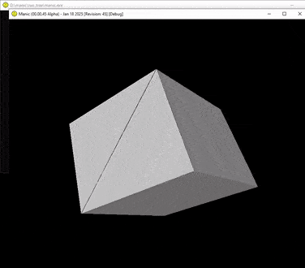

# Manic 3D Renderer



Manic is a prototype 3D software renderer. The goal is to create a 3D rendering engine that can load and display models for 
interaction. Currently, the project is in an unstable state, so be aware of potential crashes, performance issues, and other 
bugs — development is ongoing.

The main development occurs on a private server, with updates typically synced to GitHub at the end of each week.

## Development Setup Instructions
> [!NOTE]
> Only x64 is supported. While support for x86 is not specifically outlawed, it may not work as the codebase makes 
> specific assumptions about its architecture.

1. Install Required Tools (Windows SDK & MSVC)
You need the [Microsoft C/C++ Build Tools](https://visualstudio.microsoft.com/downloads/?q=build+tools) for both the Windows SDK and the MSVC Compiler. 
If you already have the Windows SDK installed, you may also build with [Clang](https://releases.llvm.org/)

2. Build Environment
The renderer can be using MSVC or Clang in the command line. This is done by calling vcvarsall.bat x64 (included with the Microsoft C/C++ Build Tools).
This can be done automatically by the `x64 Native Tools Command Prompt for VS <year>` cmd variant installed by the Microsoft C/C++ Build Tools. If you have 
installed the build tools, the command prompt can be located by searching for *native* from the Windows Start Menu.

To confirm that you have access to the MSVC Compiler after opening the cmd variant, run:

```
cl
```

If everything is set up right, you should see output similar to this:
```
Microsoft (R) C/C++ Optimizing Compiler Version 19.42.34435 for x64
Copyright (C) Microsoft Corporation.  All rights reserved.

usage: cl [ option... ] filename... [ /link linkoption... ]
```

3. Building
Within the `x64 Native Tool Command Prompt`, `cd` to the root directory of the codebase and run the `build` script like so:
```
## For MSVC
build manic msvc debug

## For Clang
build manic clang debug
```

You should see the following: 
```
[debug mode]
[msvc compile]
manic_main.c
```


## Codebase Introduction

The codebase is seperated into *layers*. The layers are meant to isolate certain concerns of the codebase . Layers
correspond with folders inside the `src` directory. One folder in the `src` directory will include multiple sub-layers,
but their structure are mostly flat and straight forward.

Layers correspond 1-to-1 with *namespaces*. The term "namespace" in this context does not refere to language specific 
features, but a naming convention for C-style namespaces written as short prefix, usually 5 characters at most but maybe
more (context and verboseness dependent). These namespaces main purpose is to quickly provide an understanding of what
the code does and what layer it belongs. Some layers do not have a namespace, but most do. Namespaces are either 
capitalized (PascalCase) or lowercase. Enums and types are capitalized (PascalCase), functions, variables and macros
are lowercased. Global variables are appended with a `g_` in front of it.

Layers depend on other layers. To prevent circular dependencies, it is arranged as a directed acyclic graph.

List of layers in the codebase and their associated namespaces:
- `base` (no namespace): Available codebase-wide. Contains strings, math, memory allocators, helper macros, etc. It 
	depends on no other layers in the codebase.
- `os/core` (`os_`): This is an abstraction layer that provides core, non-graphical functionality from the operating 
	system under an abstract API. This layer is implemented per-target operating system.
- `os/gfx` (`os_`): This is an abstarction layer that provides graphical operating system functionality from the 
	operating system under an abstract api. It builds on `os/core`. This layer is implemented per-target operating system.
- `render` (`render_`): This is an abstract API for rendering using either software rasterization or either of the 
	various GPU APIs under a common interface. This currently also implements the drawing API but it would be refactored
	to strictly implement the rendering APIs.
- `draw` (`draw_`): This implements the API that implements the drawing mechanisms. They are called by things around the 
	codebase draw to a buffer.


## References & Motivations
+ [RADDebugger](https://github.com/EpicGamesExt/raddebugger)
+ [Handmade Hero](https://www.youtube.com/playlist?list=PLnuhp3Xd9PYTt6svyQPyRO_AAuMWGxPzU)
+ [Computer Enhance](https://www.computerenhance.com)
