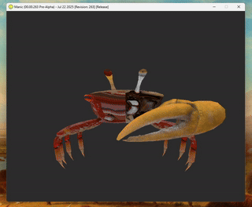

# Manic Renderer



## What is it?

Manic is a prototype 3D software rasterizer. It can load a 3D model (Wavefront Obj files), display 
it on the screen, and at 60 FPS. It can also load accompanying textures for the 3D model, all on 
the CPU.

## Why make a software rasterizer when we have GPUs?

This is an exploratory project to understand at a much deeper level how GPUs do what they do,
and simulate it on the CPU. In the days before GPUs even existed, video games and other graphics
related stuff where done completely on the CPU. Although they werent as fast given the limited 
processing power of the time period, but in 2025, CPUs are very capable computers that can do 
*billions* of computations per seconds, so I thought it'd be disgrace to harness that power to 
see what the state of rendering on the CPU is and how capable it is.

## Are GPUs a waste then?

Absolutely not, although I was able to render a couple hundred vertices consistently at 
60 frames-per-second on the CPU, but this compares in no way to the share amount of highly 
detailed 3D models you can render on the screen at 4x the frames-per-second on even a low powered 
GPU! In addition, GPUs are now everywhere, making a software rasterization completely useless other
than as a learning tool. Although, you could still make a game of the same quality using a software
rasterizer, but that would come with downsides such as running at 30FPS, lesser detailed 3D models, 
increased development time, etc., when compared to using a GPU, but trade-offs would have to be made
when it comes to what your target audience expects.

## How can I run this on my own computer?

This project is created in a way that isolates the core rendering code from the platform, meaning 
it is not platform dependent. Although only Windows 10 and above is supported, writing the platform layer 
for other platforms shouldn't be as much of a hassle. There's a downloadable version of the application in 
the release section on github.

## How do I build it?

>[!NOTE]
> ONly x64 Windows 10 and above is supported.

1. Install Required Tools (Windows SDK & MSVC)
You need the [Microsoft C/C++ Build Tools](https://visualstudio.microsoft.com/downloads/?q=build+tools) 
for both the Windows SDK and the MSVC Compiler. 
Alternativly, Clang can also be used to build the executable, but you would still need the Windows SDK. 
[Clang](https://releases.llvm.org/)

2. Build Environment
The renderer can be using MSVC or Clang in the command line. This is done by calling 
vcvarsall.bat x64 (included with the Microsoft C/C++ Build Tools). This can be done automatically by 
the `x64 Native Tools Command Prompt for VS <year>` cmd variant installed by the Microsoft C/C++ Build Tools. 
If you have installed the build tools, the command prompt can be located by searching for 
*native* from the Windows Start Menu.

To confirm that you have access to the MSVC Compiler after opening the cmd variant, run:

```
cl
```

If everything is set up right, you should see output similar to this:
```
Microsoft (R) C/C++ Optimizing Compiler Version 19.42.34435 for x64
Copyright (C) Microsoft Corporation.  All rights reserved.

usage: cl [ option... ] filename... [ /link linkoption... ]
```

3. Building
Within the `x64 Native Tool Command Prompt`, `cd` to the root directory of the codebase and run the 
`build` script like so:

```
## For MSVC
build manic msvc debug

## For Clang
build manic clang debug
```

You should see the following: 
```
[release mode]
[compiling with msvc]
main.cc
```

## References
+ [RADDebugger](https://github.com/EpicGamesExt/raddebugger)
+ [Handmade Hero](https://www.youtube.com/playlist?list=PLnuhp3Xd9PYTt6svyQPyRO_AAuMWGxPzU)
+ [Computer Enhance](https://www.computerenhance.com)
